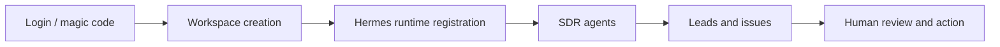
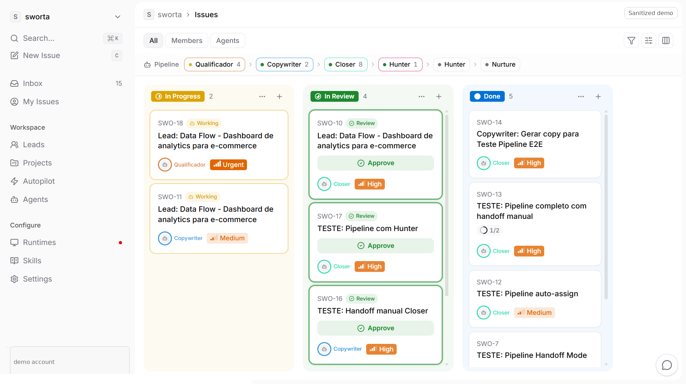
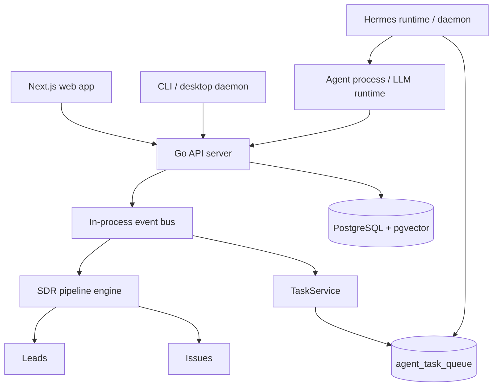

# Cimeria AI Control Plane

Cimeria is an AI agent control plane and AI SDR pipeline. It connects workspace onboarding, daemon registration, runtime task dispatch, lead capture, agent handoffs, and human-visible issues into one operational loop.

This repository is a clean public showcase of the current product direction: a real deployed system evolving from an earlier agent orchestration prototype into Cimeria, focused on applied AI agents for sales development and operational automation.

## Product Loop



The canonical SDR pipeline has five agents:

| Agent | Role |
| --- | --- |
| Hunter | Captures and opens the first opportunity workflow |
| Qualificador | Qualifies fit, urgency, ICP match, and risk |
| Copywriter | Drafts the outreach material |
| Closer | Shapes objections, next steps, and conversion motion |
| Nurture | Keeps weak or long-cycle leads alive |

## What Is Working

- Go backend with JWT auth, magic-code login, workspace APIs, WebSocket realtime, and PostgreSQL migrations.
- Next.js web app with auth, workspace, agents, runtime, issues, and leads surfaces.
- Hermes-style daemon/runtime task loop: issues become tasks, runtimes claim work, and agent output is written back to the product.
- SDR seed/pipeline code for Hunter, Qualificador, Copywriter, Closer, and Nurture.
- Lead import and lead activity surfaces under active development.
- Apollo no-send connector foundation: server-side API key handling, search preview, enrichment/import approval endpoints, candidate storage, and Leads-page UI entry point.

## Demo Evidence

Public demo media is redacted to remove workspace URLs, test account data, and private environment details.



More screenshots and a short demo clip: [docs/demo-evidence.md](docs/demo-evidence.md).

## Architecture



More detail: [docs/architecture.md](docs/architecture.md).

## Tech Stack

- Frontend: Next.js, React, TypeScript, Turborepo, pnpm.
- Backend: Go, pgx, sqlc, PostgreSQL, pgvector.
- Realtime: WebSocket hub and event fanout.
- Runtime: desktop/CLI daemon, task queue, agent issue workflow.
- Infra: Docker Compose, Caddy, Oracle VM deployment path.

## Local Development

Prerequisites:

- Node.js 22+
- pnpm 10+
- Go 1.26+
- Docker

Start locally:

```bash
pnpm install
cp .env.example .env
make setup
make start
```

Useful commands:

```bash
make check
cd server && go test ./cmd/server ./internal/service ./internal/sdr
docker compose up -d postgres
```

## Repository Map

| Path | Purpose |
| --- | --- |
| `apps/web` | Web application |
| `apps/desktop` | Desktop shell and daemon integration |
| `packages/core` | Shared API clients, types, realtime helpers |
| `packages/views` | Shared product views |
| `server` | Go API, migrations, handlers, services, SDR engine |
| `docs` | Public architecture, roadmap, and security notes |

## Status

Cimeria is an active portfolio-grade AI engineering project. The current public repo is intentionally honest: it shows the real system, the working product loop, and the next engineering steps instead of hiding the hard parts.

Current focus:

- Keep login, workspace creation, runtime registration, and issue/task dispatch stable.
- Validate Apollo live data onboarding end to end with no-send safeguards before any external outreach.
- Improve SDR pipeline decision quality and stop conditions.
- Add better observability, evaluation, and human approval flows.

Roadmap: [docs/roadmap.md](docs/roadmap.md).

## Security

No production secrets are committed. Use `.env.example` as a template only, and read [docs/security.md](docs/security.md) before deploying.
