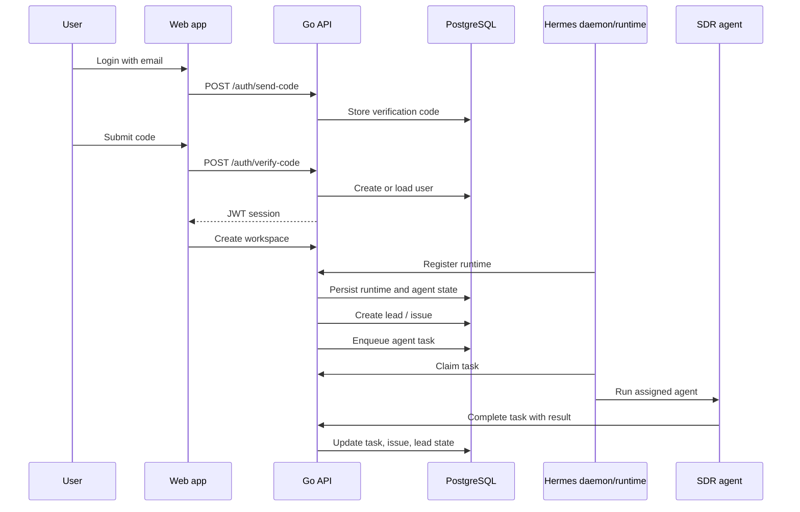
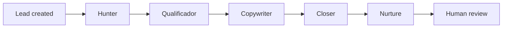

# Architecture

Cimeria is structured around one operational loop: authenticate a user, create a workspace, register a runtime, dispatch agent work, and expose the resulting lead and issue activity to the human operator.

## Runtime Flow

## Subsystems

| Subsystem | Responsibility |
| --- | --- |
| Web app | Auth, workspace UX, agents, runtime status, leads, and issues |
| API server | Auth, workspace, issue, lead, email, daemon, and runtime APIs |
| Event bus | Internal product events that fan out to task and SDR handlers |
| TaskService | Converts product events into runtime-claimable agent tasks |
| Hermes runtime | Keeps the local agent runtime connected to the control plane |
| SDR engine | Advances leads through Hunter, Qualificador, Copywriter, Closer, and Nurture |
| PostgreSQL | Durable users, workspaces, agents, tasks, leads, issues, and email logs |

## SDR Pipeline

The SDR pipeline is issue-driven. A lead event creates a Hunter issue. Completing an SDR task advances the lead state and creates the next issue in the chain. The current code includes the pipeline foundation and a known improvement area: agent output should gate progression more strictly when a lead is rejected or unsuitable.

## Data Flow

- Auth starts with `/auth/send-code` and `/auth/verify-code`.
- Workspaces scope agents, runtimes, leads, and issues.
- Daemons register against the workspace and claim queued tasks.
- Agent completions update both the issue stream and lead state.
- Realtime updates are pushed through the WebSocket hub.

## Deployment Shape

The active deployment path uses a Go backend, Next.js frontend, PostgreSQL, Caddy reverse proxy, and a native backend binary on the VM when Docker is not the best fit for the host. Docker Compose remains available for local and self-hosted environments.
