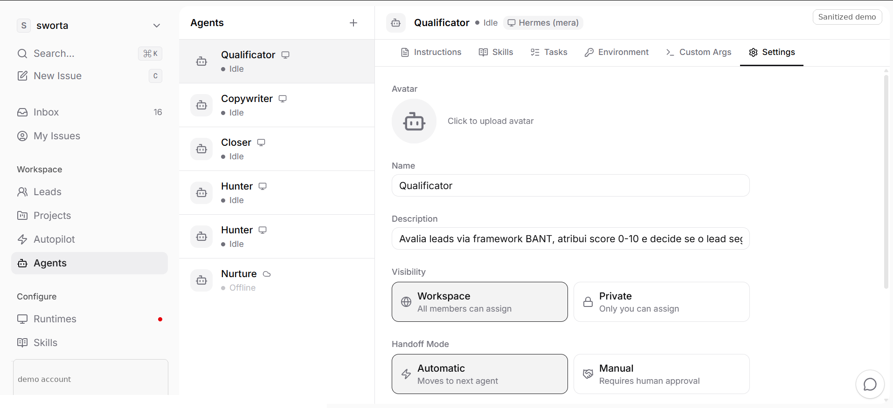
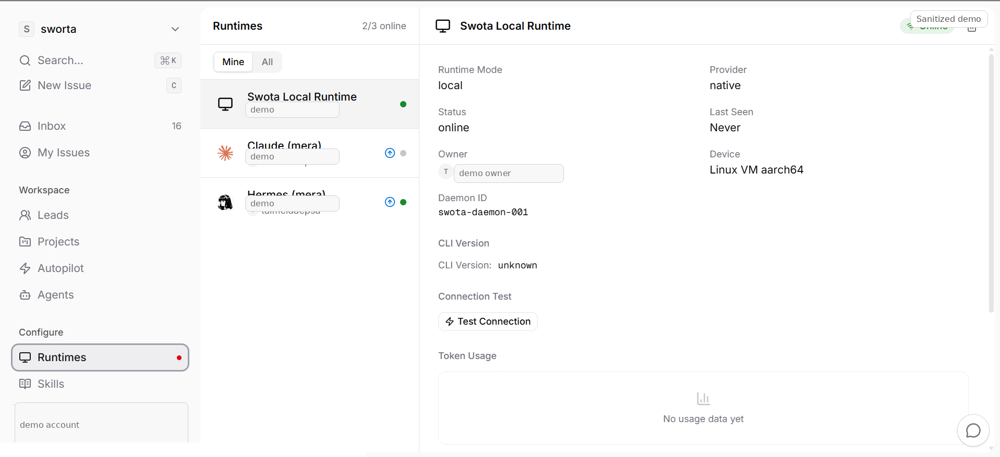
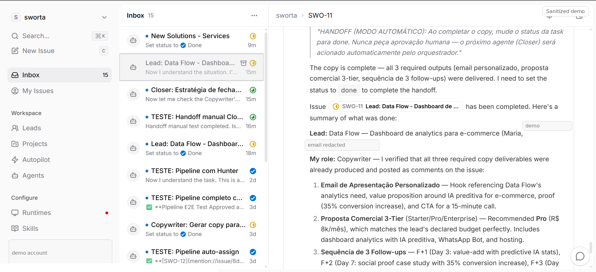
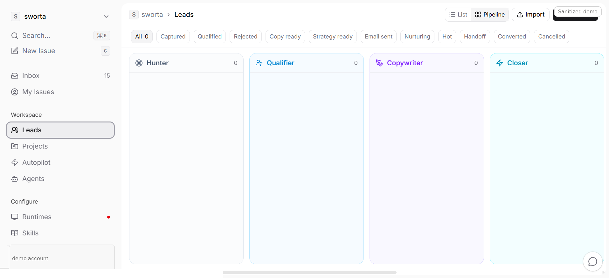
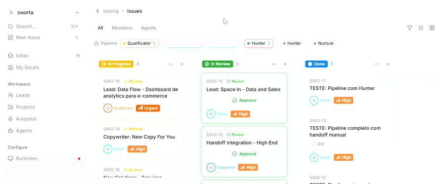

# Demo Evidence

Cimeria was validated with a visual task-board workflow showing:

- pipeline stages mapped to specialized agents;
- tasks assigned to agents;
- automatic and manual handoff modes;
- runtime connected as a local daemon;
- issue activity showing agent execution and handoff context;
- lead pipeline visibility for the SDR workflow.

> Public demo media is redacted to remove workspace URLs, test account data, and private environment details.

## Pipeline board

## Agent handoff settings

## Runtime online

## Issue activity

## Leads pipeline

## Short demo clip

A smaller MP4 version is also available at [`assets/demo/swota-demo-short.mp4`](assets/demo/swota-demo-short.mp4).
