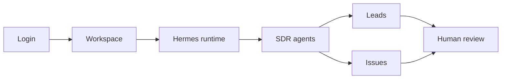

# Cimeria Design System

This document defines the public visual direction for Cimeria. It is focused on a portfolio-grade AI agent control plane and AI SDR pipeline, not on preserving inherited prototype marketing language.

## Principles

1. **Operational clarity first.** Screens should help an operator understand agents, tasks, leads, runtime state, and blockers quickly.
2. **Color is a signal.** Neutral surfaces carry most of the interface. Accent colors are reserved for status, priority, risk, approval, and agent identity.
3. **Dense, calm, repeatable.** Cimeria is an operations product. Avoid oversized marketing composition inside product screens; prefer compact controls, predictable navigation, and scannable lists.
4. **Human-in-the-loop by default.** The interface should make it obvious when an agent is acting, waiting, blocked, or asking for approval.

## Product Surfaces

The core product loop is:

Primary surfaces:

| Surface | Design goal |
| --- | --- |
| Login | Fast, quiet, trustworthy access |
| Workspace | Clear ownership and workspace context |
| Runtimes | Immediate online/offline and capability visibility |
| Agents | Distinct agent roles, status, and assignment readiness |
| Leads | Pipeline state, qualification, and next action clarity |
| Issues | Task execution, handoff, comments, and approvals |

## Typography

- Use Inter for UI and content.
- Use a restrained scale: `text-xs`, `text-sm`, and `text-base` for product surfaces.
- Reserve larger display type for public landing or portfolio documentation only.
- Prefer `font-medium` for emphasis. Avoid heavy bold text in dense operational UI.

## Color

Use design tokens instead of hard-coded color classes whenever possible.

| Signal | Use |
| --- | --- |
| Brand | Cimeria identity and rare primary emphasis |
| Success | Completed, approved, online |
| Warning | Needs attention, medium risk |
| Destructive | Failed, blocked, rejected, dangerous actions |
| Info | Secondary guidance and neutral metadata |

Guidelines:

- Keep the base UI mostly neutral.
- Do not use more than two or three semantic colors in the same dense panel unless the view is explicitly a status board.
- Use tinted backgrounds sparingly and pair them with labels or icons.

## Spacing And Layout

- Use an 8px rhythm for most product layouts.
- Keep sidebars, toolbars, lists, and boards stable in size.
- Avoid nested cards. Cards should represent repeated items, modals, or framed tools.
- Use full-width product bands or unframed constrained layouts for page sections.

## Components

- Use icons for tool actions when a familiar symbol exists.
- Use segmented controls for mutually exclusive modes.
- Use toggles or checkboxes for binary settings.
- Use menus for option sets.
- Use tabs for view switching.
- Use buttons for clear commands.

## Interaction States

Every interactive component should have clear states:

| State | Expected treatment |
| --- | --- |
| Rest | Neutral surface and readable text |
| Hover | Slight background or foreground shift |
| Active | Persistent visual distinction from hover |
| Focus | Keyboard-visible focus ring |
| Disabled | Lower contrast and no misleading hover |
| Loading | Stable dimensions and clear pending state |

Active state must remain visible while hovered.

## Agent Identity

The canonical SDR agents are:

| Agent | Role |
| --- | --- |
| Hunter | Captures leads and opens the first workflow |
| Qualificador | Scores fit, urgency, ICP match, and risk |
| Copywriter | Produces outreach material |
| Closer | Handles objections and next steps |
| Nurture | Keeps long-cycle leads alive |

Agent labels should be consistent across issues, leads, settings, and runtime activity.

## Public Assets

Public screenshots and videos must be sanitized:

- no private workspace URLs;
- no real customer data;
- no test secrets or infrastructure identifiers;
- no inherited prototype marketing screenshots;
- no placeholder product claims that are not visible in the current product.

Demo evidence lives in [docs/demo-evidence.md](demo-evidence.md).

## Anti-Patterns

Avoid:

- inherited prototype branding in public-facing Cimeria pages;
- Simplified Chinese copy unless a maintained locale is intentionally restored;
- purely decorative default mountain/robot images;
- empty demo screens as primary evidence;
- broad visual rewrites that hide the actual working product.
