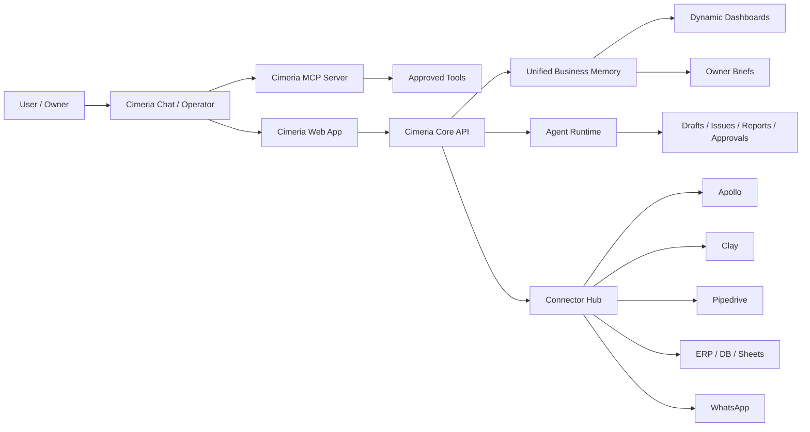

# Cimeria Expansion Ideas - 2026-05-28

This note captures product ideas from the May 28 working session so they are not lost. It is not an implementation plan. It is a strategic backlog for future specs, plans, and prototypes.

## North Star

Cimeria should evolve from an AI SDR control plane into an AI operating layer for revenue, operations, and owner decision-making.

The strongest product shape is not "another CRM" or "another dashboard". It is:

- a command center where the user talks to Cimeria in natural language;
- a connector layer that reaches Apollo, Clay, Pipedrive, ERP, databases, spreadsheets, email, WhatsApp, and web/mobile;
- a decision layer that finds money, time, bottlenecks, quality gaps, and next actions;
- an execution layer that drafts, routes, schedules, assigns, alerts, and triggers approved work.

## Main Product Families

### 1. Cimeria SDR / Revenue Control Plane

Purpose: capture, qualify, enrich, write, close, nurture, and expose activity to humans.

Modules:

- Apollo lead source: search, preview, enrich, import, no-send validation.
- Clay enrichment waterfall: use only when Apollo or internal data is incomplete.
- Pipedrive CRM handoff: create deals, update stages, add activities, sync notes, and alert owners.
- SDR agent pipeline: Hunter, Qualificador, Copywriter, Closer, Nurture.
- Approval cockpit: human reviews lead, fit, material, send readiness, and next step.
- Deal quality score: ICP fit, urgency, budget, authority, risk, likely next action.

Why it matters:

- This is the fastest path to visible value for consulting and AI automation buyers.
- It turns lead data into operational action instead of just storing contacts.

### 2. Cimeria MCP / Operator Layer

Purpose: let the user talk to Cimeria as an AI operator and have it use tools safely.

Modules:

- Cimeria MCP server: exposes safe Cimeria actions as tools.
- External agent connector: lets approved outside agents call Cimeria APIs/MCP tools.
- User command interface: "find 10 high-value leads", "prepare follow-up", "show where I am losing money".
- Tool permission model: read-only, draft-only, approval-required, execute.
- Audit trail: every tool call, data read, write, approval, and external action is recorded.

Why it matters:

- This creates the "talk to the business" experience.
- It lets Cimeria become the system other agents use, not just one app among many.

### 3. Mobile / Web Delivery Layer

Purpose: make Cimeria useful outside the desktop app.

Modules:

- Responsive web app for owner/operator workflows.
- Mobile-first daily digest.
- WhatsApp delivery for alerts, approval requests, performance notes, and quick commands.
- Email delivery for structured reports and longer summaries.
- Scheduled jobs for daily, weekly, and event-based updates.

Why it matters:

- Owners and sales leaders live on phone and WhatsApp.
- The "decision now" moment is often mobile, not dashboard-first.

### 4. Account Intelligence Chat

Purpose: a chat inside Cimeria connected to the user's account data and operational memory.

Modules:

- AI chat with database-grounded answers.
- Retrieval over leads, issues, agents, activity, emails, notes, CRM state, and workspace settings.
- Action suggestions: draft email, create issue, update CRM, schedule task, send WhatsApp, create cron job.
- Evidence links: every answer points back to records, not just a generic response.
- Workspace memory: durable context per user, lead, company, and workflow.

Why it matters:

- Users do not want to hunt through screens.
- A grounded internal AI turns the whole product into a searchable operating brain.

### 5. Cimeria Ops / Business Diagnostic Layer

Purpose: connect to ERP, databases, spreadsheets, and business systems to detect operational leaks and recommend improvements.

Inputs:

- ERP exports.
- Direct database connections.
- Spreadsheets.
- CRM data.
- Inventory data.
- Sales activity.
- Finance and billing reports.
- Team/activity logs.

Analyses:

- Average ticket.
- Margin and cash leakage.
- Stock stuck, wrong, missing, or exploding.
- Team productivity and response speed.
- Slow, overloaded, or underperforming roles.
- Operational holes and recurring delays.
- Company activity quality.
- Product/category performance.
- Customer, region, and channel quality.

Outputs:

- Business health score.
- Money-leak radar.
- Operational bottleneck map.
- Improvement plan by priority.
- Daily owner digest by WhatsApp.
- Simple mini dashboards.
- Auto-evolving dashboard that adapts as the operation changes.

Why it matters:

- This is the consultoria de IA wedge: "show me where my business is leaking money and what to do next".
- It can generate high-value consulting engagements from real evidence.

## Cross-Cutting Modules

These modules can appear in several product families.

### Connector Hub

Connects Cimeria to Apollo, Clay, Pipedrive, ERP, databases, spreadsheets, email, WhatsApp, calendars, and websites.

Use cases:

- Pull leads.
- Push CRM updates.
- Import ERP data.
- Send owner reports.
- Schedule follow-ups.
- Trigger approved automations.

### Unified Business Memory

Normalizes records into an account graph:

- people;
- companies;
- leads;
- deals;
- issues;
- tasks;
- products;
- orders;
- inventory;
- conversations;
- metrics;
- recommendations.

This makes chat, agents, dashboards, and reports all speak from the same source of truth.

### Approval and Safety Layer

Every external action should have an autonomy mode:

- read-only;
- draft-only;
- suggest;
- approval-to-send;
- approval-to-write;
- autopilot for explicitly safe actions.

This is critical for email, WhatsApp, CRM writes, ERP writes, and MCP tool access.

### ROI Ledger

Tracks impact:

- time saved;
- response time reduced;
- leads recovered;
- deals created;
- inventory corrected;
- cash leakage found;
- owner decisions triggered;
- manual work removed.

This is how Cimeria proves value to consulting clients.

## Ideas From Today's Session

### Apollo

Use Apollo for lead source and enrichment, but keep the production path API-governed:

- search preview;
- enrich approved candidates;
- import no-send leads;
- preserve source metadata;
- never expose API key;
- never send outreach without approval.

MCP can be useful for research and guided operator workflows, but API is better for repeatable product execution.

### Clay

Use Clay as a waterfall/enrichment layer after Apollo or internal sources:

- fill missing fields;
- enrich company/person context;
- add signals;
- reduce manual research;
- only call it when it adds value because enrichment can become expensive.

### Pipedrive

Use Pipedrive as the CRM handoff and sales execution layer:

- create deal from qualified lead;
- map Cimeria lead status to Pipedrive pipeline stage;
- add notes and AI summaries;
- create next activity;
- sync owner/stage/outcome back into Cimeria;
- make Cimeria the intelligence layer and Pipedrive the CRM execution record.

## High-Impact Future Additions

### AI Owner Daily Brief

Every morning:

- what changed;
- where money is leaking;
- what needs approval;
- what team/process is stuck;
- what can be fixed today;
- top 3 actions with expected impact.

Delivery:

- WhatsApp first;
- web dashboard second;
- email summary for longer detail.

### Business Leak Detector

Automatically spots:

- margin leaks;
- slow follow-up;
- stock sitting too long;
- high-value leads ignored;
- recurring operational blockers;
- team bottlenecks;
- customer churn risk;
- products with high activity but low conversion.

### Consulting Plan Generator

Turns data diagnosis into a consulting deliverable:

- problem;
- evidence;
- impact estimate;
- proposed automations;
- rollout phases;
- risks;
- expected ROI;
- next actions.

### Dynamic Executive Dashboard

Dashboards should not be static. Cimeria should learn the business and assemble views based on what matters:

- revenue view;
- operations view;
- inventory view;
- sales view;
- owner view;
- urgent decisions view.

### Agent Skill Marketplace

Reusable modules:

- SDR Hunter;
- ERP analyst;
- Inventory auditor;
- CRM closer;
- WhatsApp concierge;
- Support triage;
- Finance leak analyst;
- Ops bottleneck analyst.

## Suggested Product Architecture

## Near-Term Priority Order

1. Keep login/workspace/runtime green.
2. Finish Apollo no-send integration.
3. Add Pipedrive CRM handoff after lead quality gates.
4. Add Cimeria internal chat over workspace data.
5. Add WhatsApp/mobile owner brief.
6. Add ERP/spreadsheet diagnostic importer.
7. Add Business Leak Detector.
8. Add dynamic executive dashboards.
9. Add Cimeria MCP server with strict approval modes.
10. Add external agent connection layer.

## Naming Notes

Possible module names:

- Cimeria SDR
- Cimeria Operator
- Cimeria MCP Gateway
- Cimeria Ops
- Cimeria Owner Brief
- Cimeria Business Leak Radar
- Cimeria Decision Cockpit
- Cimeria Connector Hub

## Raw Intent Preserved

The user's core idea:

- Cimeria should connect to Apollo/Pipedrive/Clay and other systems.
- Cimeria should have an MCP layer so the user can talk to it and speed up flows.
- Cimeria should connect agents externally, not only inside the current app.
- Cimeria should have mobile/web/WhatsApp delivery.
- Cimeria should have an internal AI chat connected to all account data.
- A second Cimeria shape should connect to ERP/DB/spreadsheets and diagnose the whole business.
- It should find where time, performance, money, inventory, and people are leaking value.
- It should generate daily decision support and simple dashboards for owners.
