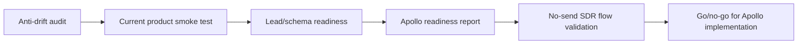

# Apollo Readiness and Anti-Drift Design

Date: 2026-05-28
Status: saved design, implementation not started

## Goal

Before integrating Apollo or any other lead source, certify that the current Cimeria product loop is stable and aligned across local code, GitHub, and the deployed VM. The next work phase is analysis-first: detect drift, prove the existing login/workspace/runtime/leads/issues flow, and only then prepare Apollo integration with email sending disabled.

The target flow for this phase is:

## Non-Goals

- Do not implement Apollo in this phase.
- Do not integrate Clay, Pipedrive, HubSpot, or other CRMs yet.
- Do not redesign frontend screens.
- Do not refactor SDR/Hermes architecture.
- Do not send email to real leads.
- Do not push to production until the audit produces a clear go/no-go.

## Recommended Approach

Use a deployment-aware audit before feature work.

Three options were considered:

1. Local-only audit: fastest, but it can miss VM drift and stale deployment state.
2. Deployment-aware audit: checks local repo, GitHub, VM runtime, migrations, logs, and current user flow. This is the recommended path.
3. Direct Apollo prototype: tempting, but it risks building on top of unknown schema/runtime drift.

The recommended option is 2 because this project has already suffered from local/Git/VM divergence, stale runtime state, and partial deploy risk. Apollo should only start after the current deployed loop is known to be healthy.

## Phase 1: Anti-Drift Baseline

Capture the state of the public repo, the active branch, and the deployed VM before changing anything.

Required checks:

- `git status -sb`
- `git remote -v`
- `git branch -vv`
- `git log --oneline --decorate -10`
- `git diff --name-only`
- `git diff --stat`
- current GitHub default branch and latest CI status
- VM commit, branch, dirty state, and deployment path
- backend runtime method on VM: Docker, systemd, native binary, or manual process
- frontend runtime method and reverse proxy path
- active backend process/container serving `app.cimeria.online`

Report only secret status as present, missing, or empty. Never print secret values.

## Phase 2: Current Product Health Check

Validate the current deployed product loop before touching integrations.

Checks:

- Login send-code returns expected success and no backend 500.
- Verify-code completes with a test account controlled by the owner.
- Workspace creation is reachable.
- Hermes/runtime registration works or has a documented blocker.
- Agents page shows the canonical SDR agents: Hunter, Qualificador, Copywriter, Closer, Nurture.
- Leads page loads without backend 500.
- Issues page loads without backend 500.
- Lead creation/import creates the expected Hunter issue.
- Runtime task claiming is not excessively noisy when there is no work.

This phase must end with a concise finding list: pass, warning, blocker, or not tested.

## Phase 3: Schema and Lead Pipeline Readiness

Audit whether the lead pipeline foundation is internally consistent before Apollo.

Checks:

- Migrations match generated SQL code.
- `lead`, `lead_source`, `lead_import_batch`, score/rule, and curator-related structures exist where the handlers expect them.
- `lead.status`, `state_machine_status`, `last_event`, source metadata, import batch, dedupe fields, and enrichment status are either supported or explicitly missing.
- Creating a lead produces a traceable pipeline event.
- Completing an SDR task advances only when the previous agent output allows it.
- Rejected, unsafe, invalid, or low-fit leads do not continue blindly through Copywriter/Closer/Nurture.

If schema drift exists, stop and classify it before Apollo work starts.

## Phase 4: Apollo Readiness

Prepare for Apollo as a server-side lead source, without implementing it yet.

Readiness checks:

- `APOLLO_API_KEY` exists and is non-empty in the intended environment, reported only as present/missing/empty.
- API access, plan limits, and credit behavior are understood before tests run.
- Apollo key is never exposed to frontend code.
- Source configuration can represent non-secret filters such as region, industry, company size, personas, and result limits.
- Lead import can preserve external IDs and metadata for dedupe and traceability.
- Apollo search/import has a dry-run path that does not create leads until approved.
- Enrichment is separate from search so credits are not burned accidentally.

Target first Apollo validation after readiness:

- query: Empresas de Inteligencia Artificial, Brasil
- target count: 10 leads
- no email sent to leads
- imported leads must be deduped, tagged with source metadata, and routed through the SDR flow only after approval

## Phase 5: No-Send SDR Flow Validation

After the current flow is proven and Apollo readiness is green, validate the full SDR path without external outreach.

Expected behavior:

- Hunter receives approved leads.
- Qualificador produces structured decision, score, confidence, rationale, and next action.
- Copywriter produces outreach material using lead context.
- Closer produces recommendation, objections, and handoff notes.
- Nurture produces follow-up plan and send-ready draft.
- No email is sent to a real lead.
- If a test send is needed, it must use only an owner-approved test inbox, such as `developercimerio@gmail.com`, and must be explicitly approved at the time of test.
- The system records enough evidence that, if sending were enabled, the email path would be ready.

Email safety requirement:

- The default validation mode is draft-only.
- Any send path must require human approval.
- External outreach must remain disabled until deliverability, suppression, unsubscribe, bounce handling, and audit logging are verified.

## Exit Criteria

The phase is complete only when all of these are true:

- No local/Git/VM drift blocks integration work.
- Login, workspace, runtime, leads, and issues are stable enough for integration testing.
- Lead schema and generated queries are consistent or blockers are documented.
- No backend 500s appear during the smoke tests.
- Apollo implementation risks are known and categorized.
- Email sending remains disabled for real leads.
- The final report includes go/no-go for Apollo implementation.

## Deliverables

- Anti-drift audit report.
- Current product health report.
- Schema/readiness findings.
- Apollo readiness checklist.
- No-send SDR validation checklist.
- Categorized todo list:
  - blockers
  - bugs
  - integration prerequisites
  - SDR quality improvements
  - observability improvements
  - SOTA opportunities

## Decision After This Phase

If readiness is green, write the Apollo implementation plan next. The first implementation should be small: server-side Apollo source/search/import with no email sending and no Clay/Pipedrive dependency.

If readiness is not green, fix blockers before any integration work.
